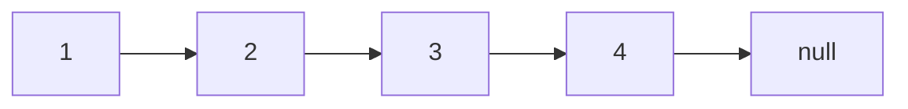

# Singly Linked List

A singly linked list is a linear data structure where elements are stored in `nodes`.

Each node contains two parts:
-   **Data:** The actual information being stored.
-   **Next:** A pointer (or reference) to the next node in the sequence.

The nodes are not stored in contiguous memory locations. Instead, they are connected by the `next` pointers.

The list has a `head` which is a pointer to the first node. The last node's "next" pointer points to null, indicating the end of the list.

`Singly` refers to the fact that each node only has a pointer to the next node, allowing traversal in only one direction.

## Example

## What is good for

* **Dynamic memory allocation:** Linked lists can grow or shrink as needed, unlike arrays with fixed sizes.

* **Frequent insertions and deletions:** Inserting or deleting nodes in a linked list is generally faster than in an array, especially at the beginning or middle.

* **Sequential traversal:** Linked lists are efficient for traversing items sequentially.

## Applications

* **Implementing Stacks and Queues:** Linked lists are ideal for these data structures.

* **Implementing dynamic lists:** where the number of items are not known in advance.

* **Implementing hash tables:** linked lists are used to handle collisions within hash tables.

* **Memory Management:** Operating systems use linked lists to manage free and allocated memory blocks.

## Disadvantages

* **Slow random access:** Accessing a specific element requires traversing the list from the head.

* **Extra memory overhead:** Each node requires additional memory to store the next pointer.

