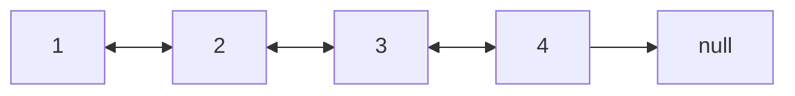

# Doubly Linked List

A doubly linked list is a linear data structure where elements are stored in `nodes`,
similar to a singly linked list

Each node contains two parts:
-   **Data:** The actual information being stored.
-   **Next:** A pointer (or reference) to the next node in the sequence.
-   **Previous:** A pointer (or reference) to the previous node in the sequence.

This `previous` pointer is the key difference, allowing traversal in both forward and backward directions.

Like a singly linked list, it has a `head` (pointer to the first node) and can also have a `tail` (pointer to the last node). The `previous` pointer of the head node is usually null, and the `next` pointer of the tail node is also null.

## Example

## What is good for

* **Bidirectional traversal is needed:** The ability to move forward and backward makes them suitable for applications where you need to navigate through data in both directions.

* **Frequent insertions and deletions are required, especially near a given node:** The `previous` pointer simplifies operations that involve modifying the list around a specific node.

## Applications

* **Implementing undo/redo functionality:** Applications like text editors or web browsers use doubly linked lists to store a history of actions, allowing users to move back and forth through the history.

* **Browser history:** Web browsers can use doubly linked lists to keep track of visited pages, allowing users to go back and forward.

* **Media players:** Media players can use doubly linked lists to manage playlists, allowing users to navigate through tracks in both directions.

* **Graphical applications:** Maintaining a list of graphical objects.

## Disadvantages

* Requires more memory than a singly linked list due to the `previous` pointer.

* Insertion and deletion operations are slightly more complex than in a singly linked list.

