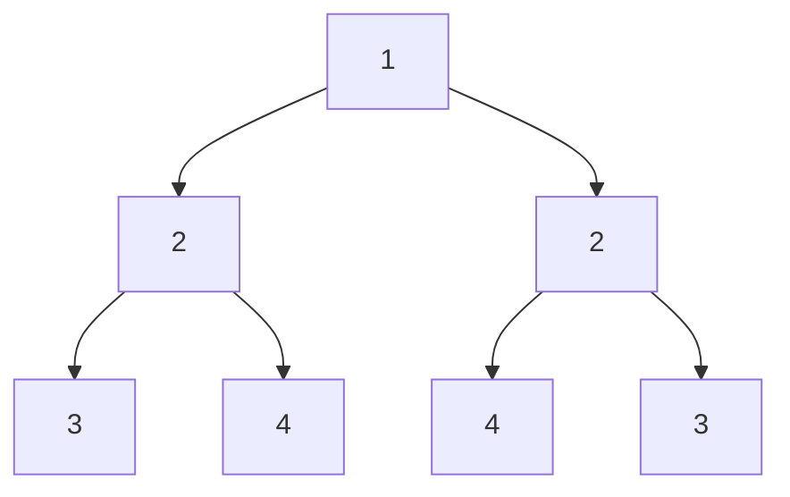
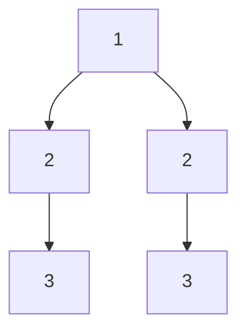

# 101. Symmetric Tree

Given the root of a binary tree, check whether it is a mirror of itself (i.e., symmetric around its center).

## Examples

- **Example 1:**

- **Input:** root = [1,2,2,3,4,4,3]
- **Output:** true

- **Example 2:**

- **Input:** root = [1,2,2,null,3,null,3]
- **Output:** false

## Constraints

- The number of nodes in the tree is in the range [1, 1000].
- -100 <= Node.val <= 100
